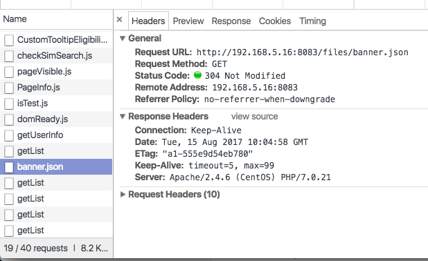
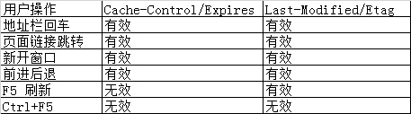

### http缓存规则

​	HTTP缓存有多种规则，根据是否需要重新向服务器发起请求来分类，可以将其分为两大类(**强制缓存，对比缓存**)，强制缓存如果生效，不需要再和服务器发生交互，而对比缓存不管是否生效，都需要与服务端发生交互。
两类缓存规则可以同时存在，强制缓存优先级高于对比缓存，也就是说，当执行强制缓存的规则时，如果缓存生效，直接使用缓存，不再执行对比缓存规则。

* #### 强制缓存

对于强制缓存来说，header中会有两个字段来标明失效规则（Expires/Cache-Control），指的是当前资源的有效期。

为方便大家理解，我们认为浏览器存在一个缓存数据库,用于存储缓存信息。
在客户端第一次请求数据时，此时缓存数据库中没有对应的缓存数据，需要请求服务器，服务器返回后，将数据存储至缓存数据库中。

 **Expires/Cache-Control规则**

1.**Expires**

​	Expires的值为服务端返回的到期时间，在响应http请求时告诉浏览器在过期时间前浏览器可以直接从浏览器缓存取数据，而无需再次请求。不过Expires 是HTTP 1.0的东西，现在默认浏览器均默认使用HTTP 1.1，所以它的作用基本忽略。Expires 的一个缺点就是，返回的到期时间是服务器端的时间，这样存在一个问题，比较的时间是客户端本地设置的时间，所以有可能会导致差错，所以在HTTP 1.1版开始，使用Cache-Control替代。

2.**Cache-Control**

​	用于定义所有的缓存机制都必须遵循的缓存指示，这些指示是一些特定的指令，包括public、private、no-cache(表示可以存储，但在重新验正其有效性之前不能用于响应客户端请求)、no-store、max-age、s-maxage以及must-revalidate等；Cache-Control中设定的时间会覆盖Expires中指定的时间；

* #### 对比缓存

对比缓存，顾名思义，需要进行比较判断是否可以使用缓存。
浏览器第一次请求数据时，服务器会将缓存标识与数据一起返回给客户端，客户端将二者备份至缓存数据库中。
再次请求数据时，客户端将备份的缓存标识发送给服务器，服务器根据缓存标识进行判断，判断成功后，返回304状态码，通知客户端比较成功，可以使用缓存数据。

在对比缓存生效时，状态码为304，并且报文大小和请求时间大大减少。
原因是，服务端在进行标识比较后，只返回header部分，通过状态码通知客户端使用缓存，不再需要将报文主体部分返回给客户端。
对于对比缓存来说，缓存标识的传递是我们着重需要理解的，它在请求header和响应header间进行传递，一共分为两种标识传递，接下来，我们分开介绍。

**Last-Modified/If-Modified-Since**规则

**1.Last-Modified**

服务器在响应请求时，告诉浏览器资源的最后修改时间。

**2.If-Modified-Since**

再次请求服务器时，通过此字段通知服务器上次请求时，服务器返回的资源最后修改时间。
服务器收到请求后发现有头If-Modified-Since 则与被请求资源的最后修改时间进行比对。
若资源的最后修改时间大于If-Modified-Since，说明资源又被改动过，则响应整片资源内容，返回状态码200；
若资源的最后修改时间小于或等于If-Modified-Since，说明资源无新修改，则响应HTTP 304，告知浏览器继续使用所保存的cache。

**Etag/If-None-Match**规则（优先级高于Last-Modified/If-Modified-Since）

**1.Etag**

服务器资源的唯一标识符, 浏览器可以根据ETag值缓存数据, 节省带宽. 如果资源已经改变, etag可以帮助防止同步更新资源的相互覆盖. ETag 优先级比 Last-Modified 高.

**2.If-None-Match**

再次请求服务器时，通过此字段通知服务器客户段缓存数据的唯一标识。
服务器收到请求后发现有头If-None-Match 则与被请求资源的唯一标识进行比对，
不同，说明资源又被改动过，则响应整片资源内容，返回状态码200；
相同，说明资源无新修改，则响应HTTP 304，告知浏览器继续使用所保存的cache。

****

看到这里，你也许会问，既然已经有了 Last-Modified 已经能够知道本地缓存是否是最新的了，为什么还需要 Etag 呢？
主要是基于以下几个原因：Last-Modified 标注的最后修改时间只能精确到秒，如果有些资源在一秒之内被多次修改的话，他就不能准确标注文件的新鲜度了如果某些资源会被定期生成，当内容没有变化，但 Last-Modified 却改变了，导致文件没使用缓存有可能存在服务器没有准确获取资源修改时间，或者与代理服务器时间不一致的情形。

* #### 用户的操作对于缓存的影响

  

* #### 不能缓存的请求

1.不能被缓存的请求HTTP 信息头中包含Cache-Control:no-cache，pragma:no-cache，或Cache-Control:max-age=0 等告诉浏览器不用缓存的请求
2.需要根据Cookie，认证信息等决定输入内容的动态请求是不能被缓存的
3.经过HTTPS安全加密的请求（有人也经过测试发现，ie 其实在头部加入 Cache-Control：max-age 信息，firefox 在头部加入 Cache-Control:Public 之后，能够对HTTPS的资源进行缓存）
4.HTTP 响应头中不包含 Last-Modified/Etag，也不包含 Cache-Control/Expires 的请求无法被缓存
5.目前浏览器的实现是不会对POST请求的响应做缓存的（从语义上来说也不应该），并且规范中也规定了返回状态码不允许是304。不过这并不表示POST的响应不能被缓存，根据[RFC 7231 - Hypertext Transfer Protocol (HTTP/1.1): Semantics and Content](https://link.zhihu.com/?target=https://tools.ietf.org/html/rfc7231#section-4.3.3)中描述的，如果在POST请求对应的响应中包含Freshness相关信息的话，这次响应也是可以被缓存，具体可以参考上面的那个链接。