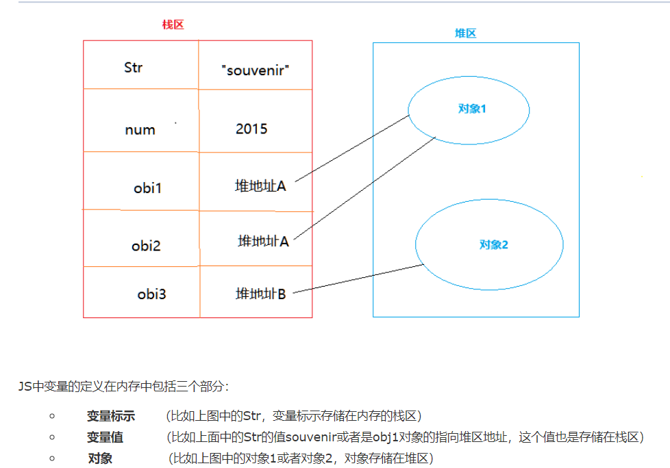

# 题目

说出如下内容打印的值是什么？

```javascript
const c = new Date();
    const d = [];
    for (let i = 0; i < 3; i++) {
        const obj = {
            a: c,
            b: c.getDate()
        }
        d.push(obj);
        c.setDate(c.getDate() + 1);
    }
    console.log(d[0].a === d[1].a);
    function Person(name) {
        this.name = name
        return name;
    }
    let p = new Person('Tom');
    console.log(p);
    function Person2(name) {
        this.name = name
        return {};
    }
    let p2 = new Person2('Tom');
    console.log(p2);
```


# 解析

**问题解析：**

​    1).知识点1: Date相关知识(这个有很多，不一一列举);

​    2).知识点2: new 构造函数做了什么？

​        创建一个对象， 将构造函数的作用域赋给新对象， 执行构造函数中的代码， 返回新对象。重点在返回新对象，当构造函数有return但是return的不是对象的时候，新对象不受影响，但是如果return的是对象的时候，新对象会被return的对象覆盖；

​        因此console.log(p)  {name:'Tom'}   console.log(p2)  {}

​    2) 知识点2: js变量存储

​        js内存分为栈区（stack）和堆区（heap）,对于基本数据类型(Number,String,Boolean,Undefined,Null)来说,是存在内存的栈区,而对象存储在堆区。当某一个变量赋值对象时，赋值的是对象在堆区的引用地址。




因为c是对象

所以 d[0].a  和  d[1].a 值都是指向同一个地址  console.log(d[0].a === d[1].a)  true;


### 参与者

回答：

// 毛毛

// d[0].a === d[1].a   false

// {name:'Tom'}

// {}

​    

//阿冬

// true 因为的d[0].a 和d[1].a指向的引用地址是一个

// {name:'Tom'}

// {}