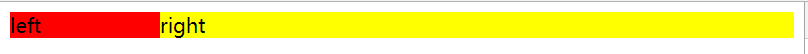
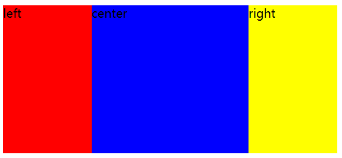
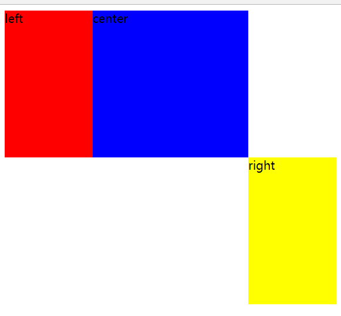

# 题目

用css实现：<br/>
    效果1：左边定宽，右边自适应方案；<br/>
    效果2：左右两边定宽，中间自适应

```html & css
效果1：
/* 方案1 */
html
<div class="left" style="background-color: #f00;">left</div>
<div class="right" style="background-color: yellow;">right</div>
css
.left {
  width: 120px;
  float: left;
}
.right {
  margin-left: 120px;
}

/* 方案2 */
html
<div class="left" style="background-color: #f00;">left</div>
<div class="right" style="background-color: yellow;">right</div>
css
.left {
  width: 120px;
  float: left;
}
.right {
  width: calc(100% - 120px);
  float: left;
}

/* 方案3 */
html
<div class="perent">
    <div class="left" style="background-color: #f00;">left</div>
    <div class="right" style="background-color: yellow;">right</div>
</div>
css
.perent{
  display: flex;
  width: 100%;
}
.left {
  width: 120px;
}
.right {
  width: calc(100% - 120px);
}
```
效果1如图：



```html & css
效果2：
html
<div class="wrap">
    <div class="left" style="background-color: #f00;">left</div>
    <div class="right" style="background-color: yellow;">right</div>
    <div class="center " style="background-color: blue;">center</div>
</div>
css
.wrap {
  width: 100%;
  height: 200px;
}
.wrap > div {
  height: 100%;
}
/* 方案1 */
.left {
  width: 120px;
  float: left;
}
.right {
  float: right;
  width: 120px;
}
.center {
  margin: 0 120px;
}
/* 方案2 */
.left {
  width: 120px;
  float: left;
}
.right {
  float: right;
  width: 120px;
}
.center {
  width: calc(100% - 240px);
  margin-left: 120px;
}
/* 方案3 */
html
<div class="wrap">
    <div class="left" style="background-color: #f00;">left</div>
    <div class="center " style="background-color: blue;">center</div>
    <div class="right" style="background-color: yellow;">right</div>
</div>
css
.wrap {
  display: flex;
   height: 200px;
}
.left {
  width: 120px;
}
.right {
  width: 120px;
}
.center {
  flex: 1;
}
```
效果2如图：


## 说明

效果2中一共有三种方案，方案1、2的html和方案3的html是不一样的，主要区别点在center元素的位置，如果将方案3的html应用到方案1、2中的话，会形成意想不到的效果，如下图：

这就很奇怪了，right居然不在最右；其实原因也很简单left是脱离了文本流，但是center依然要独占一行，所以right哪怕脱离了文本流依然不能移动到到center所在行。当然实现上述效果的方法肯定不止我列举出来的，例如还可以用position，具体方法我就不列出来了，有兴趣的童鞋可以自己试一下；
